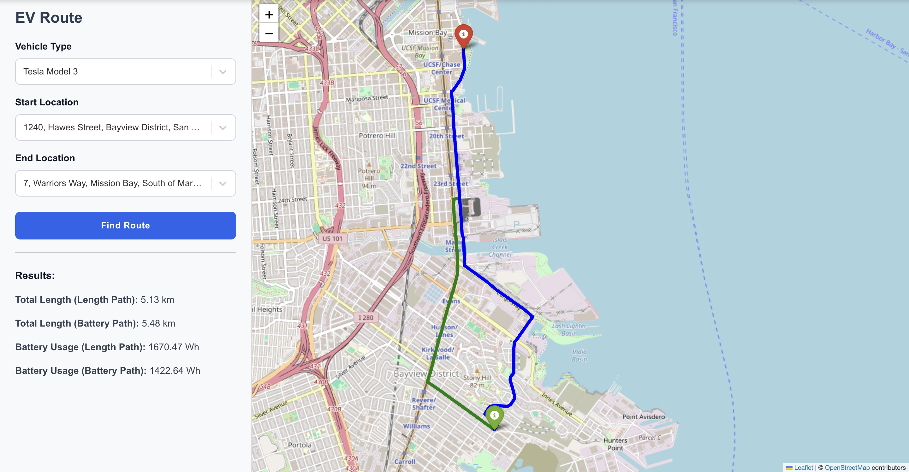

# EV Route


### Environment
```
conda create -n ox -c conda-forge --strict-channel-priority osmnx
conda activate ox
pip install -r requirements.txt

cd frontend
npm install
npm install react-select
npm run dev

cd backend
uvicorn main:app --reload --host 0.0.0.0 --port 8000
```